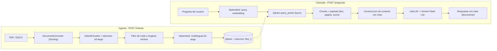

# Agent4U

> Sistema RAG (Retrieval-Augmented Generation) en español: ingesta estructurada de documentos, recuperación densa sobre Qdrant y generación de respuestas citadas — con un arnés de evaluación propio para medir la calidad del pipeline en cada cambio.


## Visión general

Agent4U recibe documentos (PDF/DOCX), los convierte en fragmentos con estructura semántica, los indexa en una base vectorial y responde preguntas en lenguaje natural citando la fuente exacta de cada afirmación. El objetivo del proyecto es doble: servir como un RAG realmente usable sobre documentación propia, y como banco de pruebas para decisiones de diseño de RAG (chunking, embeddings, distancia de similitud, evaluación) documentadas y medidas, no solo intuidas.

El backend es la parte madura del proyecto; el frontend todavía no existe. Este README describe honestamente qué está implementado y qué está planificado — para el detalle de cómo se llegó a cada decisión, ver el [diario de desarrollo](docs/DIARIO_DESARROLLO.md).

## Índice

- [Características](#características)
- [Arquitectura](#arquitectura)
- [Stack tecnológico](#stack-tecnológico)
- [Estructura del proyecto](#estructura-del-proyecto)
- [Puesta en marcha](#puesta-en-marcha)
- [Variables de entorno](#variables-de-entorno)
- [Uso de la API](#uso-de-la-api)
- [Cómo funciona el pipeline](#cómo-funciona-el-pipeline)
- [Evaluación del sistema](#evaluación-del-sistema)
- [Calidad y desarrollo](#calidad-y-desarrollo)
- [Flujo de trabajo con Git](#flujo-de-trabajo-con-git)
- [Roadmap y traza de mejoras](#roadmap-y-traza-de-mejoras)
- [Documentación adicional](#documentación-adicional)
- [Licencia](#licencia)

## Características

- **Ingesta estructurada de PDF/DOCX** con [Docling](https://docling-project.github.io/docling/): conserva títulos, secciones y tablas en lugar de extraer texto plano sin orden de lectura.
- **Chunking semántico** vía `HybridChunker`, atado al mismo tokenizer que el modelo de embeddings — evita fragmentos que rompan el límite de tokens del modelo.
- **Filtrado de ruido**: descarta chunks que son solo cabecera/pie de página o demasiado cortos para aportar contexto.
- **Recuperación densa multilingüe** (`multilingual-e5-large`, 1024 dimensiones) sobre Qdrant con distancia coseno.
- **Payload enriquecido por chunk**: documento de origen, páginas, encabezados y fecha de indexación — necesario para citar fuentes con precisión.
- **Ingesta idempotente**: los IDs son deterministas (`uuid5` sobre el texto del chunk), así que reindexar el mismo documento no duplica datos.
- **Generación con citas obligatorias** vía [LiteLLM](https://docs.litellm.ai/) (Gemini Flash Lite por defecto, intercambiable por otro proveedor sin tocar código) y un system prompt que fuerza a no alucinar fuera del contexto recuperado.
- **Arnés de evaluación end-to-end propio**: 25 preguntas fijas de 5 tipos distintos, contra un corpus de prueba de 11 documentos, con informes HTML/CSV por corrida (ver [Evaluación del sistema](#evaluación-del-sistema)).

## Arquitectura



Ambos flujos comparten el mismo embedder (`fastembed`) y la misma colección de Qdrant, cargados una sola vez en el `lifespan` de FastAPI (`app/api/app_state.py`) para no pagar el coste de inicialización en cada petición.

## Stack tecnológico

| Área | Tecnología | Estado |
|---|---|---|
| Backend / API | Python 3.12 + FastAPI (uvicorn) | Hecho |
| Gestión de dependencias | uv | Hecho |
| Ingesta / parsing | Docling — PDF/DOCX con estructura | Hecho |
| Ingesta / parsing | Trafilatura — limpieza de HTML desde URLs | Planificado |
| Chunking | Docling `HybridChunker` + tokenizer de e5-large | Hecho |
| Embeddings densos | fastembed — `intfloat/multilingual-e5-large` (1024 dim) | Hecho |
| Embeddings dispersos | fastembed — `Qdrant/bm25` | Prototipo suelto (`app/ingest/vector_disperso.py`), no integrado en el retrieval |
| Base vectorial | Qdrant (dense, distancia coseno) | Hecho |
| Recuperación | Híbrida (dense + sparse con RRF) | Planificado |
| Generación | LiteLLM, por defecto `gemini/gemini-flash-lite-latest` | Hecho |
| Generación | Streaming de respuesta por SSE | Planificado — hoy `/preguntar` devuelve JSON bloqueante |
| Orquestación agéntica | LangGraph | Planificado — dependencia aún no añadida |
| Validación / config | Pydantic v2 + pydantic-settings | Hecho |
| Frontend | React + Vite + TypeScript | Planificado — carpeta `frontend/` reservada, sin scaffold |
| Contenedores | Docker Compose | Parcial — solo el servicio de Qdrant |
| Lint / tipado | ruff + mypy configurados | Hecho (ver [deuda técnica](#deuda-técnica-conocida)) |
| Tests unitarios | pytest | Configurado, sin `test_*.py` todavía |
| Evaluación RAG | Arnés propio (25 preguntas, informes HTML/CSV) | Hecho |
| Evaluación RAG | RAGAS | Planificado / opcional |
| CI/CD | GitHub Actions | Planificado |

## Estructura del proyecto

```text
Agent4U/
├── backend/
│   ├── app/
│   │   ├── api/
│   │   │   ├── app_state.py       # lifespan de FastAPI: carga embedder, Qdrant, Docling y tokenizer al arrancar
│   │   │   └── schemas.py         # modelos Pydantic de entrada (Consulta, Indexar)
│   │   ├── core/
│   │   │   └── config.py          # Settings vía pydantic-settings, leídas desde .env
│   │   ├── ingest/
│   │   │   ├── ingest.py          # script exploratorio del pipeline de ingesta (ruta local hardcodeada, no productivo)
│   │   │   └── vector_disperso.py # prototipo de embeddings dispersos (BM25), aún no integrado
│   │   ├── rag/
│   │   │   ├── indexation.py      # normalize_text() + embed_texts(): pipeline real detrás de /indexar
│   │   │   └── generation.py      # build_context() + generate_response(): pipeline real detrás de /preguntar
│   │   ├── retrieval/
│   │   │   ├── retrieval.py       # buscar_chunks(): búsqueda densa en Qdrant, usada por /preguntar
│   │   │   └── llm.py             # script suelto de humo para probar la conexión con LiteLLM/Gemini
│   │   └── main.py                # app FastAPI y los dos endpoints (/preguntar, /indexar)
│   ├── tests/
│   │   ├── response_file.json     # 25 preguntas de evaluación (5 tipos, 11 documentos distintos)
│   │   ├── response_test.py       # arnés de evaluación end-to-end (no es una suite de pytest)
│   │   └── results/               # informes HTML/CSV + JSON crudo por cada corrida
│   ├── pyproject.toml
│   └── uv.lock
├── frontend/                      # reservado para la fase de UI (React + Vite), vacío por ahora
├── docs/
│   └── DIARIO_DESARROLLO.md       # notas de aprendizaje y decisiones, día a día
├── docker-compose.yml             # servicio de Qdrant
└── README.md
```

## Puesta en marcha

**Requisitos**: Docker Desktop (o Docker Engine) y [uv](https://docs.astral.sh/uv/) instalados.

```bash
docker --version
uv --version
```

```bash
# 1. Clonar y entrar en el proyecto
git clone https://github.com/Pepe-alms/AGENT4U.git
cd AGENT4U

# 2. Levantar Qdrant
docker compose up -d qdrant
# Dashboard disponible en http://localhost:6333/dashboard

# 3. Instalar dependencias del backend (runtime + dev)
cd backend
uv sync

# 4. Configurar variables de entorno
#    backend/.env.example existe pero está vacío por ahora;
#    crea backend/.env con el contenido de la sección siguiente

# 5. Levantar la API
uv run uvicorn app.main:app --reload
# http://127.0.0.1:8000/docs para la documentación interactiva (Swagger UI)
```

La primera ejecución descarga los modelos de ML de Docling y fastembed desde Hugging Face Hub (requiere red); a partir de ahí quedan cacheados en local (`~/.cache/huggingface/`) y el pipeline corre offline.

## Variables de entorno

| Variable | Prefijo | Obligatoria | Valor por defecto | Descripción |
|---|---|---|---|---|
| `GEMINI_API_KEY` | ninguno | Sí | — | API key de [Google AI Studio](https://aistudio.google.com/), usada por LiteLLM para llamar a Gemini |
| `APP_QDRANT_URL` | `APP_` | No | `http://localhost:6333` | URL del servidor Qdrant |
| `APP_LLM_MODEL` | `APP_` | No | `gemini/gemini-flash-lite-latest` | Identificador de modelo que recibe LiteLLM |

```bash
# backend/.env
GEMINI_API_KEY=tu-api-key-de-google-ai-studio
APP_QDRANT_URL=http://localhost:6333
APP_LLM_MODEL=gemini/gemini-flash-lite-latest
```

> `GEMINI_API_KEY` se lee sin prefijo (`os.getenv` directo en `app/core/config.py`), mientras que el resto de variables usan el prefijo `APP_` vía `pydantic-settings`. Es una inconsistencia menor, pendiente de unificar — ver [deuda técnica](#deuda-técnica-conocida).

## Uso de la API

Con el servidor arrancado, hay dos endpoints. FastAPI expone además documentación interactiva automática en `/docs` (Swagger UI) y `/redoc`.

### `POST /indexar`

Parsea un documento, lo trocea, genera embeddings y lo indexa en Qdrant. Espera una ruta de fichero **accesible por el proceso del servidor** — no es un endpoint de subida `multipart`, pensado para uso local por ahora.

```bash
curl -X POST http://localhost:8000/indexar \
  -H "Content-Type: application/json" \
  -d '{
        "ruta_archivo": "/ruta/absoluta/al/documento.pdf",
        "nombre": "manual-usuario-v2"
      }'
```

```json
{ "status": "indexado" }
```

> El campo `nombre` del payload se valida pero no se usa todavía en el handler (el nombre real del documento se extrae de los metadatos de Docling). Ver [deuda técnica](#deuda-técnica-conocida).

### `POST /preguntar`

Recupera los fragmentos más relevantes para la pregunta y genera una respuesta citando el documento de origen.

```bash
curl -X POST http://localhost:8000/preguntar \
  -H "Content-Type: application/json" \
  -d '{ "query": "¿Qué tres propiedades no pueden garantizarse a la vez según el teorema CAP?" }'
```

```json
{
  "respuesta": "Consistencia, disponibilidad y tolerancia a particiones de red [02-bases-datos-nosql.md]."
}
```

## Cómo funciona el pipeline

### Ingesta (`app/rag/indexation.py`)

`normalize_text()` convierte el documento con Docling, lo trocea con `HybridChunker` y descarta ruido antes de embeber nada:

```python
RUIDO = {"page_header", "page_footer"}

for chunk in chunks:
    etiquetas = {item.label.value for item in chunk.meta.doc_items}
    if etiquetas and etiquetas <= RUIDO:
        continue  # chunk formado solo por cabecera/pie de pagina

    texto = chunker.contextualize(chunk)
    if len(texto) < 100:
        continue  # demasiado corto para aportar contexto util
```

`embed_texts()` genera los vectores y hace `upsert` en Qdrant con un ID determinista, calculado a partir del propio texto del chunk. Esto hace que reindexar el mismo documento sea idempotente en lugar de duplicar datos:

```python
def id_desde_texto(texto: str) -> str:
    return str(uuid.uuid5(uuid.NAMESPACE_DNS, texto))
```

### Recuperación (`app/retrieval/retrieval.py`)

`buscar_chunks()` embebe la pregunta con el prefijo `query:` (asimetría dense-retrieval estándar en modelos de la familia e5, que se entrenan distinguiendo `query:` de `passage:`) y llama a `qdrant.query_points()`, el método de búsqueda vigente en `qdrant-client` (sustituye al `search()` clásico, ya en desuso).

### Generación (`app/rag/generation.py`)

`build_context()` concatena los chunks recuperados etiquetados por documento; `generate_response()` los envía a LiteLLM junto con un system prompt que obliga a citar la fuente y a admitir cuando no hay respuesta en el contexto:

```python
system_prompt = """Eres un asistente que responde preguntas basándote ÚNICAMENTE en el contexto proporcionado.

Reglas estrictas:
- Responde solo con información presente en el contexto. No uses conocimiento previo.
- Si el contexto no contiene la respuesta, di exactamente: "No encuentro esa información en el documento." No inventes ni completes con lo que sepas.
- Cita el documento del que sacas la informacion con [nombre del documento], con el formato [documento1], [documento2], etc."""
```

### Decisiones de diseño

- **Docling frente a `pdfplumber`/`PyPDF2`**: estos últimos dan acceso a la geometría cruda del PDF (caracteres, coordenadas) pero no entienden qué es un título, una tabla o el orden de lectura — hay que reconstruir el significado a mano. Docling usa modelos ML pequeños y locales para reconstruir la estructura, y solo necesita red la primera vez que descarga esos modelos; a partir de ahí es 100% offline (compatible con entornos air-gapped).
- **`multilingual-e5-large` frente a alternativas más ligeras**: rinde mejor en recuperación multilingüe/español que la familia `paraphrase-multilingual` (entrenada para similitud de frases, no para búsqueda). Es más lento en CPU que un `MiniLM`, pero el proyecto prioriza calidad de recuperación sobre velocidad.
- **Distancia coseno frente a producto escalar (`DOT`) en Qdrant**: los vectores que produce fastembed no salen normalizados. Con `DOT` sin normalizar, los fragmentos con vector de mayor magnitud ganarían el ranking independientemente de su relevancia real. Qdrant normaliza internamente al insertar con `COSINE`, así que no hay coste de rendimiento por elegirla frente a `DOT`.

## Evaluación del sistema

`backend/tests/response_test.py` no es una suite de pytest — es un script que ejecuta preguntas reales contra el pipeline completo (Qdrant + LLM en vivo) y mide dos cosas por separado:

- **Eficacia**: ¿la respuesta generada es correcta? Se mide por similitud coseno entre el embedding de la respuesta y el de la respuesta esperada (umbral configurable), no por coincidencia literal — un LLM puede parafrasear correctamente. Para preguntas de tipo `ausente`, comprueba que el sistema reconoce cuándo *no* tiene la información en vez de inventar.
- **Ejecución**: ¿qué documentos recuperó cada consulta, cuánto tardó, hubo errores? Independiente de si la respuesta final fue correcta.

```bash
cd backend
uv run python tests/response_test.py
uv run python tests/response_test.py --rondas 3 --umbral-similitud 0.85
```

Cada corrida genera un directorio `tests/results/run_<timestamp>/` con dos informes HTML, sus CSV equivalentes y el detalle crudo en JSON.

**Último resultado registrado** (`run_20260815_182655`, 25 preguntas × 5 rondas = 125 consultas):

| Métrica | Valor |
|---|---|
| Precisión global (respuesta correcta) | 100% |
| Retrieval global (documento esperado recuperado) | 100% |
| Errores definitivos | 0 |
| Modelo evaluado | `gemini/gemini-flash-lite-latest` |
| Umbral de similitud coseno | 0.85 |

El dataset de evaluación es pequeño y fijo (25 preguntas sobre 11 documentos, repartidas en 5 tipos: exacta, semántica, tabla, discriminación y ausente) — sirve como red de seguridad de regresión para detectar si un cambio degrada el pipeline, no como benchmark estadísticamente robusto.

## Calidad y desarrollo

```bash
cd backend
uv run ruff check .        # lint
uv run ruff format .       # formateo
uv run mypy app             # tipado estático
uv run pytest -v            # tests unitarios
```

**Estado actual** (honesto, no aspiracional): `ruff` señala 4 avisos de imports sin usar (en su mayoría en los scripts de prototipo) y `mypy` reporta 5 errores de tipado, concentrados en `ingest.py` y en tipos no anotados con precisión en `retrieval.py`/`indexation.py`. `pytest` no falla, pero tampoco recolecta ningún test todavía — ver [deuda técnica](#deuda-técnica-conocida).

## Flujo de trabajo con Git

Convención de ramas:

| Prefijo | Uso | Ejemplo |
|---|---|---|
| `feature/` | Nuevas funcionalidades | `feature/retrieval-hibrido` |
| `bugfix/` | Corrección de errores no críticos | `bugfix/payload-paginas` |
| `hotfix/` | Arreglos urgentes sobre `main` | `hotfix/error-conexion-qdrant` |
| `release/` | Preparación de una versión | `release/v0.2.0` |
| `docs/` | Cambios solo de documentación | `docs/readme-actualizado` |

Convención de commits observada en el historial (prefijo + descripción en presente): `ADD:` funcionalidad o fichero nuevo, `FIX:` corrección de un error, `FEAT:` hito o funcionalidad significativa.

```bash
git checkout -b feature/nombre-corto
git add <ficheros>
git commit -m "ADD: descripcion breve en presente"
git push -u origin feature/nombre-corto
```

## Roadmap y traza de mejoras

### Historial (hitos completados)

| Fecha | Hito |
|---|---|
| 2026-07-19 | Estructura inicial del monorepo, `uv init`, primer commit |
| 2026-08-07 | Primeros endpoints (salud, conexión a Qdrant) |
| 2026-08-08 | Ingesta con Docling + primer `upsert` de colecciones a Qdrant |
| 2026-08-09 | Retrieval: consulta de vectores desde Qdrant |
| 2026-08-14 | Indexación y retrieval conectados end-to-end vía API; payload con nombre de documento |
| 2026-08-15 | MVP funcional (Docling + fastembed + LiteLLM integrados); payload enriquecido con páginas y encabezados; arnés de evaluación con 25 preguntas |

### En curso / próximos pasos

| Fase | Alcance | Estado |
|---|---|---|
| Retrieval híbrido | Combinar dense + sparse (`BM25`) con RRF | Parcial — sparse prototipado en `vector_disperso.py`, sin integrar |
| Generación con streaming | Respuesta por SSE en `/preguntar` | Planificado — hoy la respuesta es JSON bloqueante |
| Capa agéntica | Grafo con LangGraph: decidir si recuperar, reformular query, autocrítica | Planificado — sin iniciar |
| Frontend | Chat con streaming, subida de documentos, visor de fuentes citadas (React + Vite) | Planificado — carpeta reservada, sin scaffold |
| CI/CD | GitHub Actions: lint → tests → evaluación → build | Planificado — sin workflows todavía |
| Evaluación | Adoptar RAGAS o ampliar el arnés propio con más preguntas | Parcial — arnés propio ya operativo (ver [Evaluación del sistema](#evaluación-del-sistema)) |

### Ideas anotadas para la ingesta

- **Cachear el documento parseado con `save_as_json`**: parsear es la parte cara del pipeline (el modelo de layout, ~90s por documento); trocear es barato. Guardar el `DoclingDocument` ya parseado permitiría probar otro tamaño de chunk o reindexar tras cambiar de modelo de embeddings sin repetir el parseo — de minutos a segundos por iteración.
- **Ajustar la configuración de `DocumentConverter`**: hoy solo se desactiva el OCR; hay más superficie de configuración disponible, por ejemplo:

```python
from docling.datamodel.accelerator_options import AcceleratorOptions, AcceleratorDevice
from docling.datamodel.pipeline_options import PdfPipelineOptions, TableFormerMode

opciones = PdfPipelineOptions(do_ocr=False, do_table_structure=True)
opciones.table_structure_options.mode = TableFormerMode.ACCURATE
opciones.accelerator_options = AcceleratorOptions(num_threads=4, device=AcceleratorDevice.AUTO)
```

### Deuda técnica conocida

- Sin tests unitarios: `pytest` está configurado (`testpaths`, `asyncio_mode`) pero no recolecta nada todavía; solo existe el arnés de evaluación end-to-end.
- `ruff`/`mypy` no están en verde (ver [Calidad y desarrollo](#calidad-y-desarrollo)); no hay CI que lo haga cumplir todavía.
- El campo `nombre` de `Indexar` se acepta en el esquema pero no se usa en el handler de `/indexar`.
- Inconsistencia de prefijo entre `GEMINI_API_KEY` (sin prefijo) y el resto de variables (`APP_`) en `app/core/config.py`.
- `app/ingest/ingest.py` y `app/retrieval/llm.py` son scripts exploratorios (con rutas locales hardcodeadas) que conviven con el código productivo — candidatos a mover fuera de `app/` o eliminar.
- Artefactos de build (`__pycache__/`, `.pyc`, `.DS_Store`) están versionados en git; falta ampliar `.gitignore`.
- No hay endpoint de *health check* actualmente (existió en una versión anterior de `main.py`, se perdió al cablear las rutas reales).

## Documentación adicional

El [diario de desarrollo](docs/DIARIO_DESARROLLO.md) recoge, día a día, el razonamiento completo detrás de cada decisión (por qué Docling, por qué esta métrica de distancia, cómo funciona `fastembed` por dentro, referencia de la API de `QdrantClient`, etc.) — útil como bitácora de aprendizaje, no como documentación de referencia.

## Licencia

Sin licencia definida todavía. Hasta que se añada una, se asume todos los derechos reservados por el autor.
